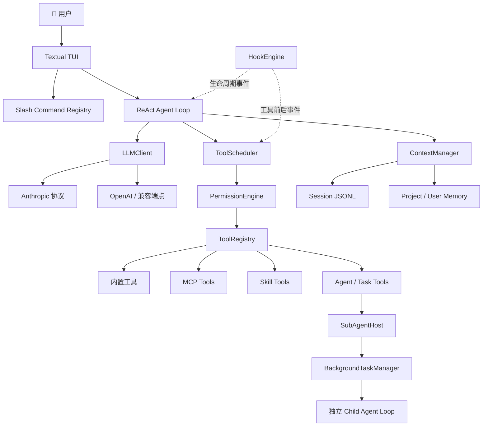

<div align="center">

<pre>
 ▗▄   ▄▖   Dragon Code
▐██▙▄▟██▌  Multi-provider coding agent
▝██▀█▀██▘  Think · Act · Verify
  ▘   ▝
</pre>

# 🐉 Dragon Code

**一个使用 Python 从零构建的、Claude Code 风格终端 AI 编程助手。**

让模型不只回答问题，还能理解项目、调用工具、修改代码、运行验证，并把复杂任务委派给独立的子 Agent。

<p>
  
  
  
  
  
</p>

[核心能力](#features) · [系统架构](#architecture) · [快速开始](#quick-start) · [使用指南](#usage) · [源码导航](#source-guide) · [开发进度](#roadmap)

</div>

> Dragon Code 不是一个只能对话的模型 API 套壳。它已经具备完整 Agent Loop、工具系统、权限控制、MCP、上下文管理、长期记忆、Skill、Hook 和 SubAgent 等工程能力。

<a id="features"></a>

## ✨ 核心能力

<table>
  <thead>
    <tr>
      <th width="27%">能力域</th>
      <th width="73%">Dragon Code 能做什么</th>
    </tr>
  </thead>
  <tbody>
    <tr>
      <td width="27%"><strong>⚡ 自主执行与工具调用</strong></td>
      <td width="73%">ReAct Agent Loop 持续调用 Read、Write、Edit、Bash、Glob、Grep，依据结果调整策略，直到任务完成。</td>
    </tr>
    <tr>
      <td width="27%"><strong>🧠 上下文与持久记忆</strong></td>
      <td width="73%">支持大结果落盘重读、上下文压缩、JSONL 会话恢复、项目指令和分层长期记忆。</td>
    </tr>
    <tr>
      <td width="27%"><strong>🛡️ 权限与安全边界</strong></td>
      <td width="73%">黑名单、路径沙箱、三级规则、四种权限模式和人在回路共同保护本地环境。</td>
    </tr>
    <tr>
      <td width="27%"><strong>🧩 MCP、Skill 与 Hook</strong></td>
      <td width="73%">支持 stdio/Streamable HTTP MCP、模块化 Skill 和完整生命周期 Hook。</td>
    </tr>
    <tr>
      <td width="27%"><strong>🎛️ 终端交互与反馈</strong></td>
      <td width="73%">Textual TUI、Markdown 定型、Slash Command 补全、低饱和工具状态和 Token 统计。</td>
    </tr>
    <tr>
      <td width="27%"><strong>🔀 模型与任务协作</strong></td>
      <td width="73%">统一 LLMClient 适配多种协议，定义式与 Fork 式 SubAgent 负责隔离复杂任务。</td>
    </tr>
  </tbody>
</table>

<a id="architecture"></a>

## 🏗️ 系统架构



主链路保持简单：用户输入进入 TUI，普通消息交给 Agent Loop；模型请求工具时先经过调度与权限检查，再由统一注册中心执行。复杂子任务可以进入独立子 Agent，上下文、权限状态和 Token 统计与主 Agent 隔离。

<a id="quick-start"></a>

## 🚀 快速开始

### 1. 环境要求

- Python 3.12+
- [uv](https://docs.astral.sh/uv/)
- Git
- WSL/Linux + tmux（仅用于最终端到端验收）

### 2. 安装依赖

```bash
git clone https://github.com/lgh88666/Dragon-Code.git
cd Dragon-Code
uv sync --locked
```

### 3. 创建本地配置

Windows PowerShell：

```powershell
Copy-Item .dragon-code/config.yaml.example .dragon-code/config.yaml
```

Linux/macOS/WSL：

```bash
cp .dragon-code/config.yaml.example .dragon-code/config.yaml
```

编辑 `.dragon-code/config.yaml`，至少配置一个 Provider：

```yaml
providers:
  - name: "Anthropic"
    protocol: "anthropic"
    api_key: "填入你的 API Key"
    model: "填入模型名称"
    thinking: true
```

也可以使用 OpenAI 或兼容端点：

```yaml
providers:
  - name: "OpenAI Compatible"
    protocol: "openai"
    api_key: "填入你的 API Key"
    model: "填入模型名称"
    base_url: "https://你的服务地址/v1"
    context_window: 128000
    summary_model: "可选的轻量摘要模型"
```

> `.dragon-code/config.yaml` 已被 Git 忽略。不要把真实 API Key、Token 或 Authorization 写入 README、示例文件或提交记录。

### 4. 启动

```bash
uv run dragon-code
```

也可以使用模块入口：

```bash
uv run python -m dragon_code
```

启动后可以尝试：

```text
阅读 pyproject.toml，告诉我这个项目用了哪些核心依赖。
```

```text
分析权限系统和 Agent Loop 的关系，把两个子任务交给不同的子 Agent，最后汇总结论。
```

<a id="usage"></a>

## 🧭 使用指南

### 常用命令

| 命令 | 作用 |
|---|---|
| `/help` | 查看当前命令、别名和用法 |
| `/status` | 查看 Provider、模型、Token、缓存、工具和记忆状态 |
| `/plan` | 进入只读 Plan Mode，只允许分析和制定计划 |
| `/do` | 退出 Plan Mode，并立即按上文计划执行 |
| `/compact` | 手动压缩较早的对话上下文 |
| `/resume` | 搜索并恢复当前项目的历史会话 |
| `/session` | 查看和管理会话 |
| `/memory` | 查看和管理长期记忆 |
| `/permission` | 查看并切换权限模式 |
| `/skill` | 查看、加载和重新扫描 Skills |
| `/hooks` | 查看已加载的生命周期 Hook 安全元信息 |
| `/clear` | 开始一个新的空白会话 |
| `/commit` | 使用内置 Skill 分析改动并生成规范提交 |
| `/review` | 在独立只读 Agent 中审查代码 |
| `/test` | 运行测试并判断源码缺陷或测试缺陷 |
| `/exit` | 安全退出 Dragon Code |

### 快捷键

| 按键 | 行为 |
|---|---|
| `Enter` | 提交消息 |
| `Alt+Enter` | 在输入框中换行 |
| `Tab` / `↑` / `↓` | 补全或选择 Slash Command |
| `Shift+Tab` | 循环切换权限模式 |
| `Esc` | 取消当前 Agent 任务 |
| `Ctrl+B` | 将支持的前台子 Agent 切到后台 |
| `Ctrl+C` | 复制选中文本；任务中取消；空闲时退出 |

<details>
<summary><strong>🔌 MCP Server 配置</strong></summary>

项目级和用户级 `mcp_servers` 会按名称合并。支持本地 stdio 与远程 Streamable HTTP：

```yaml
mcp_servers:
  local_demo:
    type: stdio
    command: uv
    args: [run, python, tests/fixtures/mcp_test_server.py]

  remote_demo:
    type: http
    url: https://example.com/mcp
    headers:
      Authorization: "Bearer ${MCP_HTTP_TOKEN}"
```

成功发现的远端工具以 `mcp__服务名__工具名` 注册。单个 Server 启动失败不会影响其他 Server 和内置工具。

</details>

<details>
<summary><strong>🛡️ 权限模式与规则</strong></summary>

工具执行依次经过：危险命令黑名单 → 项目路径沙箱 → 权限规则 → 当前模式 → 用户确认。

- `default`：只读工具自动允许，写文件和 Bash 需要确认。
- `acceptEdits`：文件读写自动允许，Bash 需要确认。
- `plan`：只向模型提供 Read、Glob、Grep。
- `bypassPermissions`：普通操作自动允许，但不能绕过黑名单、沙箱和显式 deny。

```yaml
permissions:
  mode: default
  allow:
    - Bash(git status)
    - Read(docs/**)
  deny:
    - Read(.env)
    - Write(.git/**)
```

</details>

<details>
<summary><strong>🧠 会话、上下文与记忆</strong></summary>

- 对话以 JSONL 追加保存在 `.dragon-code/sessions/`，可通过 `/resume` 恢复。
- 大型 ToolResult 会自动落盘，模型获得稳定预览和 Read 分页重读路径。
- 接近模型窗口时自动生成结构化摘要，也可以执行 `/compact`。
- 项目指令从三层 `DRAGON.md` 加载，并支持安全的 `@include`。
- 自动记忆区分用户偏好、纠正反馈、项目知识和参考资料，项目级与用户级分开保存。

</details>

<a id="source-guide"></a>

## 🗂️ 源码导航

```text
src/dragon_code/
├── agent.py              # ReAct Agent Loop 与统一事件流
├── clients/              # Anthropic / OpenAI LLMClient
├── tools/                # 六个内置工具与 ToolRegistry
├── permissions/          # 黑名单、沙箱、规则、模式与人在回路
├── mcp/                  # MCP 配置、连接管理和工具适配
├── context/              # 大结果落盘、Token 估算与上下文压缩
├── sessions/             # JSONL 会话写入、读取和恢复
├── memory/               # 用户级与项目级长期记忆
├── command/              # Slash Command 注册、分发和补全
├── skills/               # Skill 发现、激活、执行与自定义工具
├── hooks/                # 生命周期 Hook 条件与动作引擎
├── subagents/            # 定义式/Fork 子 Agent 与后台任务管理
├── prompt.py             # 模块化 System Prompt 与 reminder
└── tui.py                # Textual 界面和 AgentEvent 消费
```

想从主流程开始阅读，推荐顺序：

```text
cli.py → tui.py → agent.py → clients/ → tool_scheduler.py
       → permissions/ → tools/registry.py → subagents/
```

<a id="roadmap"></a>

## 🗺️ 开发进度

当前 ch02–ch13 已完成；ch14 正在进行 Git Worktree 的理论学习和实现规划。

| 阶段 | 状态 | 主要能力 |
|---|---|---|
| ch02–ch05 | ✅ 已完成 | 多协议对话、工具系统、Agent Loop、系统提示与缓存 |
| ch06–ch08 | ✅ 已完成 | 权限系统、MCP 客户端、上下文管理 |
| ch09–ch10 | ✅ 已完成 | 会话/记忆持久化、Slash Command 框架 |
| ch11–ch13 | ✅ 已完成 | Skill、Hook、SubAgent 与后台任务 |
| ch14 | 📖 学习与规划中 | Git Worktree 文件系统隔离 |
| 后续 | 🧭 计划中 | Agent Team、评估体系与工程完善 |

每个章节都使用 Spec 驱动流程：

```text
spec.md → plan.md → task.md → checklist.md → 开发 → tmux 验收 → 核心源码回顾
```

完整项目状态见 [`docs/PROJECT_HANDOFF.md`](docs/PROJECT_HANDOFF.md)，各章设计和验收证据位于 [`specs/`](specs/)。

## 🧪 开发与验证

```bash
uv sync --locked
uv run ruff format --check .
uv run ruff check .
uv run pytest -q
```

最近一次完整本地验收结果：`530 passed, 2 skipped`。真实模型链路会额外在 tmux 中启动 Dragon Code，输入会触发当章能力的请求，并对照 checklist 记录证据。

## 🔭 当前边界

Dragon Code 当前仍不包含 Git Worktree 文件隔离、Agent Team、MCP Resources/Prompts、网络访问限制、资源配额和完整审计日志。这些能力会在后续章节逐步补齐，不会提前标记为已完成。

---

<div align="center">

**Built one chapter at a time — 让每一条龙焰都有测试证据。🐉**

</div>
