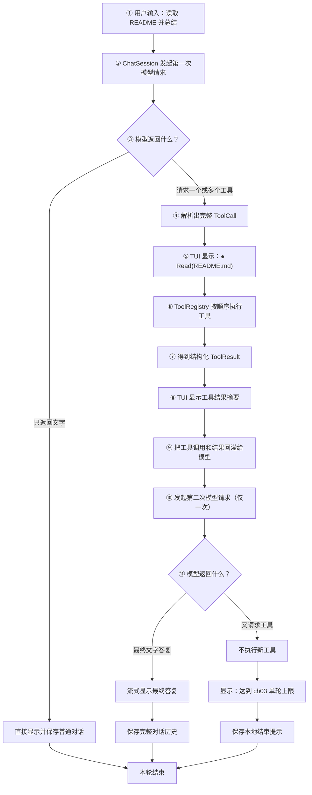

# Dragon Code 工具系统 Plan

## 架构概览

ch03 采用五层结构，每一层只负责一件事。

### 1. 工具定义层

定义统一工具接口、参数模型、工具元信息、调用请求和结构化结果。六个工具都遵守
同一套执行约定。

### 2. 注册与执行层

注册六个工具、按名称查找、提供工具定义，并统一处理参数校验、超时、未知工具和
异常转换。文件路径范围检查也集中在这一层的公共辅助模块中。

### 3. 协议适配层

Anthropic 与 OpenAI Provider 分别完成：

- 将统一工具定义转换为各自 API 格式。
- 将内部消息历史转换为协议消息。
- 拼接流式工具参数。
- 将响应转换成统一的文本或工具调用事件。

SDK 对象不会传入会话层或 TUI。

### 4. 单轮协调层

`ChatSession` 负责本章的闭环规则：

- 发出首轮请求。
- 收集模型工具调用。
- 顺序执行全部工具。
- 回灌工具结果。
- 发出一次最终续答。
- 拒绝执行续答阶段的新工具调用。

对话历史使用协议无关的消息结构保存。

### 5. 界面层

Textual worker 消费统一会话事件。TUI 只负责展示文本、工具行、执行摘要、错误和
计时，不了解 Anthropic/OpenAI 的协议格式，也不直接执行工具。

整体依赖方向：

```text
TUI
 ↓
ChatSession + Conversation
 ↓
Provider 适配器  ← 统一消息/事件 →  ToolRegistry
                                       ↓
                                六个核心工具
```

Spec 覆盖关系：

| 功能需求 | 设计归属 |
|---|---|
| F1 统一工具抽象 | `Tool`、参数模型和工具元信息 |
| F2 工具注册中心 | `ToolRegistry` |
| F3 六个核心工具 | 文件、搜索和 Bash 工具模块 |
| F4 文件访问范围 | 路径检查模块 |
| F5 工具定义注入 | `ToolRegistry` 与两个 Provider |
| F6 流式工具调用解析 | `ProviderEvent` 与两个 Provider |
| F7 工具执行与结构化结果 | `Tool.execute()`、`ToolRegistry`、`ToolResult` |
| F8 结果回灌与单轮续答 | `ChatSession` 与 `Conversation` |
| F9 跨协议一致性 | AnthropicProvider 与 OpenAIProvider |
| F10 TUI 工具展示 | `TurnEvent` 与 TUI |
| F11 会话恢复能力 | 工具基类、`ChatSession` 与 TUI |

## 核心数据结构

参数校验使用 Pydantic。每个工具只定义一个简单参数模型，它会同时生成 JSON
Schema 并校验模型传来的参数。

### ToolDefinition

```python
@dataclass
class ToolDefinition:
    name: str
    description: str
    input_schema: dict
    category: str
    read_only: bool
    destructive: bool
    is_concurrency_safe: bool
```

### ToolCall

```python
@dataclass
class ToolCall:
    id: str
    name: str
    arguments: dict | None
    raw_arguments: str = ""
    parse_error: str = ""
```

`arguments=None` 表示 JSON 参数已经接收完毕，但无法解析。注册中心会把它转换成
`invalid_json` 结果，不会执行具体工具。

### ToolResult

```python
@dataclass
class ToolResult:
    call_id: str
    tool_name: str
    success: bool
    content: str = ""
    error_code: str = ""
    error_message: str = ""
    metadata: dict = field(default_factory=dict)
    truncated: bool = False

    def to_model_text(self) -> str:
        """转换成回灌给模型的 JSON 文本。"""
```

### ChatMessage

```python
@dataclass
class ChatMessage:
    role: str
    content: str = ""
    tool_calls: list[ToolCall] = field(default_factory=list)
    tool_results: list[ToolResult] = field(default_factory=list)
    hidden_blocks: list[dict] = field(default_factory=list)
```

`hidden_blocks` 只保存 Anthropic 工具续答强制要求的 `thinking` 和
`redacted_thinking` 块。它不会交给 TUI，OpenAI Provider 会忽略它。

### ProviderEvent

```python
@dataclass
class ProviderEvent:
    type: str
    text: str = ""
    tool_call: ToolCall | None = None
    message: ChatMessage | None = None
```

Provider 事件类型：

- `text_delta`：正文增量。
- `tool_call`：已经完成 JSON 拼接的工具调用。
- `completed`：本次模型响应结束，携带完整 Assistant 消息。

### TurnEvent

```python
@dataclass
class TurnEvent:
    type: str
    text: str = ""
    tool_call: ToolCall | None = None
    tool_result: ToolResult | None = None
    error: Exception | None = None
```

TUI 事件类型：

- `text`：正文增量。
- `tool_call`：显示工具行。
- `tool_result`：显示结果摘要。
- `completed`：Markdown 定型并结束本轮。
- `limit`：显示续答阶段的单轮工具上限。
- `error`：显示模型服务错误。

## 核心接口

### Tool

```python
class Tool:
    name: str
    description: str
    category: str
    read_only: bool
    destructive: bool
    is_concurrency_safe: bool
    arguments_model: type[BaseModel]
    timeout_seconds: float = 30.0

    def definition(self) -> ToolDefinition:
        """根据元信息和参数模型生成统一工具定义。"""

    async def execute(self, call: ToolCall) -> ToolResult:
        """统一完成参数校验、超时保护和异常转换。"""

    async def run(self, call: ToolCall, arguments: BaseModel) -> ToolResult:
        """由六个具体工具分别实现实际操作。"""
```

`execute()` 的公共流程只实现一次；六个工具只实现自己的 `run()`。

### 工具参数模型

```python
class ReadArguments(BaseModel):
    path: str


class WriteArguments(BaseModel):
    path: str
    content: str


class EditArguments(BaseModel):
    path: str
    old_text: str
    new_text: str


class BashArguments(BaseModel):
    command: str


class GlobArguments(BaseModel):
    pattern: str


class GrepArguments(BaseModel):
    pattern: str
    path: str = "."
```

`Grep.pattern` 按正则表达式解释；`path` 可以指定某个文件或子目录。

### 工具元信息

| 工具 | category | read_only | destructive | is_concurrency_safe |
|---|---|---:|---:|---:|
| Read | filesystem | true | false | true |
| Write | filesystem | false | true | false |
| Edit | filesystem | false | true | false |
| Bash | command | false | true | false |
| Glob | search | true | false | true |
| Grep | search | true | false | true |

Bash 被保守地标记为破坏性且不可并发，因为仅凭命令文本无法可靠判断副作用。

### ToolRegistry

```python
class ToolRegistry:
    def register(self, tool: Tool) -> None: ...
    def get(self, name: str) -> Tool | None: ...
    def definitions(self) -> list[ToolDefinition]: ...
    async def execute(self, call: ToolCall) -> ToolResult: ...
```

### BaseProvider

```python
class BaseProvider:
    async def stream(
        self,
        messages: list[ChatMessage],
        system_prompt: str,
        tools: list[ToolDefinition],
    ):
        """依次产生 text_delta、tool_call 和 completed 事件。"""
```

注册中心输出协议无关的定义；Anthropic 和 OpenAI Provider 在发送请求前分别
转换成自己的 API 格式。

## 模块设计

### 工具公共基类

**职责：**

- 保存工具名称、描述、分类及安全元信息。
- 使用 Pydantic 参数模型生成 JSON Schema。
- 在执行前校验参数。
- 使用固定超时保护执行过程。
- 将参数错误、超时和未预期异常转换成 `ToolResult`。

**依赖：** Pydantic、`asyncio`、共享数据模型。

### 路径检查模块

**职责：**

- 保存 Dragon Code 启动时的工作目录。
- 把模型提供的相对或绝对路径解析成规范绝对路径。
- 使用解析后的真实路径判断其是否位于工作目录内。
- 阻止 `../`、绝对越界路径和符号链接越界。

```python
resolve_workspace_path(workdir: Path, user_path: str) -> Path
```

路径越界时抛出专用安全错误，工具基类再将它转换成结构化结果。

### Read、Write、Edit

三个文件工具放在同一模块，共同使用路径检查和 UTF-8 文本处理。

**Read：**

- 校验文件存在且为普通文件。
- 使用 UTF-8 读取。
- 给每行添加从 1 开始的行号。
- 最多返回 2000 行或 100,000 个字符。
- 超出上限时设置 `truncated=true`。

**Write：**

- 检查目标路径位于工作目录内。
- 自动创建父目录。
- 使用 UTF-8 创建或覆盖文件。
- 返回写入字符数和目标相对路径。

**Edit：**

- 读取文件并统计 `old_text` 的精确匹配次数。
- 只有匹配次数为 1 时才写回。
- 匹配 0 次或多次时不修改文件。
- 成功时返回目标路径和替换结果摘要。

三个工具的磁盘操作通过 `asyncio.to_thread()` 执行，避免大文件操作阻塞
Textual 事件循环。

### Glob、Grep

两个搜索工具放在同一模块。

**Glob：**

- 仅在工作目录中执行模式匹配。
- 只返回文件，不返回目录。
- 结果按相对路径排序。
- 最多返回 200 个路径，超出后标记截断。

**Grep：**

- 将 `pattern` 编译为正则表达式。
- `path` 可以指向一个文件或工作目录内的子目录。
- 递归读取文本文件，返回相对路径、行号和命中行。
- 跳过 `.git`、`.venv`、`node_modules`、`__pycache__` 等常见无关目录。
- 跳过无法按 UTF-8 解码的二进制文件。
- 最多返回 200 个命中，每条命中行最多保留 500 个字符。
- 无命中属于成功的空结果，不作为工具错误。

搜索过程通过 `asyncio.to_thread()` 执行。

### Bash

**职责：**

- 使用当前操作系统的默认 shell 执行命令。
- Windows 下使用系统命令解释器，WSL/Linux 下使用 `/bin/sh`。
- 工作目录固定为 Dragon Code 启动目录。
- 异步读取 stdout、stderr 和退出码。
- 默认超时 30 秒；超时后终止子进程。
- stdout 与 stderr 合计最多回灌 100,000 个字符。
- 非零退出返回 `success=false`，同时保留 stdout、stderr 和退出码。

### ToolRegistry

**职责：**

- 启动时登记六个工具。
- 拒绝重复工具名。
- 按名称查找工具。
- 输出所有统一工具定义。
- 将未知工具转换为 `unknown_tool` 结果。
- 调用工具的统一 `execute()` 入口。

默认注册顺序：

```text
Read → Write → Edit → Bash → Glob → Grep
```

### BaseProvider

**职责：**

- 定义两种 Provider 共用的流式接口。
- 接收统一消息历史和工具定义。
- 产出统一 `ProviderEvent`。
- 保留现有 SDK 异常脱敏行为。

### OpenAIProvider

**请求转换：**

- 在消息开头加入 system prompt。
- 普通用户和助手消息转换为 `role=user/assistant`。
- Assistant 工具调用转换为 `tool_calls`。
- 每个工具结果转换为独立的 `role=tool` 消息，并通过 `tool_call_id` 关联。
- 工具定义转换为 OpenAI 的 `type=function` 格式。

**流式解析：**

- 继续使用 `chat.completions.create(stream=True)`，兼容 DeepSeek 等 OpenAI
  兼容端点。
- 使用 `tool_call.index` 区分同一回复中的多个调用。
- 分别拼接调用 ID、工具名称和 JSON 参数。
- 流结束后按 index 排序并生成完整 `ToolCall`。
- JSON 无法解析时保留原始参数并设置 `parse_error`。

### AnthropicProvider

**请求转换：**

- 工具定义转换为 `name + description + input_schema`。
- Assistant 工具调用转换为 `tool_use` 内容块。
- 工具结果转换为下一条 user 消息中的 `tool_result` 内容块。
- 失败结果设置 `is_error=true`。
- 隐藏的 `thinking` 与 `redacted_thinking` 块放在对应 Assistant 消息开头，
  并保持内容不变。

**流式解析：**

- 正文事件转换为 `text_delta`。
- 按内容块 index 记录 `tool_use` 的 ID、名称和 JSON 参数片段。
- 内容块结束时生成完整 `ToolCall`。
- `thinking` 与 `redacted_thinking` 只写入完整 Assistant 消息的
  `hidden_blocks`，不产生 TUI 事件。
- 流结束时产生包含正文、工具调用和隐藏块的 `completed` 事件。

### Conversation

```python
get_messages() -> list[ChatMessage]
build_request_messages(user_text: str) -> list[ChatMessage]
commit_messages(messages: list[ChatMessage]) -> None
```

规则：

- 返回历史副本，避免外部误改。
- 完整一轮结束后一次性提交本轮消息。
- 普通对话保存用户消息和 Assistant 文本。
- 工具对话依次保存用户消息、Assistant 工具调用、全部工具结果、最终 Assistant
  答复。
- Provider 网络请求失败时不提交当前轮，沿用 ch02 行为。
- 历史只保存在当前进程内。

### ChatSession

`ChatSession` 新增 `ToolRegistry` 依赖，负责完整单轮流程：

```text
首轮模型请求
   ├─ 没有工具 → 提交普通对话 → completed
   └─ 有工具
        ↓
      逐个发送 tool_call 事件
        ↓
      按顺序执行并发送 tool_result 事件
        ↓
      构造临时工具历史并发起一次续答
        ├─ 返回正文 → 提交完整工具对话 → completed
        └─ 再次调用工具 → 不执行 → 提交本地上限提示 → limit
```

同批次某个工具失败时，继续执行后续调用。

续答阶段再次调用工具时：

- TUI 可以看到该调用被拒绝。
- 不把未执行的工具调用写入正式历史。
- 保存一条 Assistant 文本：
  “已达到 ch03 的单轮工具调用上限，本轮不会继续执行工具。”
- 当前轮结束，输入框重新可用。

### System Prompt

把现有“仅支持文本对话”的提示改成动态构建：

```python
build_system_prompt(workdir: Path) -> str
```

内容包括：

- Dragon Code 的编程助手身份。
- 当前工作目录和操作系统。
- 六个工具的使用原则。
- 必须先获得工具结果，不能假装已经执行。
- 文件工具只能访问工作目录。
- 工具失败后根据结构化结果调整最终答复。
- 本章只有一轮工具执行机会，应尽量在首轮一次请求所需工具。

具体参数说明放在各工具 `description` 与 Pydantic 字段描述中，避免 system prompt
重复全部 Schema。

### TUI

继续使用现有异步 Textual worker，不增加线程共享状态。

新增事件处理：

- `tool_call`：先把正在显示的前置文本写入 scrollback，再显示工具行。
- `tool_result`：显示绿色成功摘要或红色失败摘要。
- 第二次模型请求的文本继续在流式区域实时显示。
- `completed`：按 Markdown 定型最终文字。
- `limit`：显示黄色单轮上限提示并恢复输入框。

关键参数展示规则：

- Read、Write、Edit：显示路径。
- Bash：显示命令，过长时截断。
- Glob：显示模式。
- Grep：显示搜索模式和范围。

TUI 只展示结果摘要，完整 `ToolResult` 只回灌给模型。

## 模块交互

### 完整流程



一句话概括：

```text
用户提问
→ 模型决定用什么工具
→ Dragon Code 执行工具
→ 工具结果交还模型
→ 模型生成最终答复
→ 停止
```

各模块作用：

```text
ChatSession   = 总指挥，控制只能执行一轮工具
Provider      = 翻译员，负责 Anthropic/OpenAI 格式转换
ToolRegistry  = 调度员，根据工具名找到并执行工具
具体工具       = 真正读写文件或运行命令
TUI           = 显示工具行、结果和最终答复
```

### 工具结果的消息方向

工具结果属于模型下一次请求的输入，而不是 Assistant 自己生成的回答。

| 内部消息 | Anthropic | OpenAI |
|---|---|---|
| 用户提问 | `role=user` 文本 | `role=user` 文本 |
| 模型请求工具 | `role=assistant`，包含 `tool_use` | `role=assistant`，包含 `tool_calls` |
| 工具执行结果 | `role=user`，包含 `tool_result` | `role=tool`，带 `tool_call_id` |
| 模型最终答复 | `role=assistant` 文本 | `role=assistant` 文本 |

统一历史中的 `role="tool"` 是 Dragon Code 的内部表示：

```text
内部 role=tool
    ├─ AnthropicProvider → user/tool_result
    └─ OpenAIProvider    → tool/tool_call_id
```

### 多工具调用

模型一次返回三个工具时：

```text
Read(call_1) → ToolResult(call_1)
Grep(call_2) → ToolResult(call_2)
Bash(call_3) → ToolResult(call_3)
```

执行始终串行。每个结果通过 `call_id` 与原调用关联。即使 `Grep` 失败，`Bash`
仍会执行，最后把三个结果一起回灌。

### 错误数据流

```text
JSON 无法解析
  → ToolCall(arguments=None)
  → ToolRegistry 返回 invalid_json
  → TUI 显示失败摘要
  → 结构化结果仍回灌模型

路径越界 / 参数错误 / 文件错误
  → Tool.execute 捕获
  → 返回对应 error_code
  → 不抛到 ChatSession

Provider 网络或鉴权错误
  → ProviderError
  → TurnEvent(error)
  → TUI 恢复输入
  → 当前轮不写入历史
```

### 单轮上限数据流

```text
首轮工具执行完成
  → 结果回灌
  → 模型续答再次返回 tool_call
  → ChatSession 不调用 ToolRegistry
  → TUI 显示黄色上限提示
  → 保存本地 Assistant 结束文本
  → 当前轮结束
```

未执行的第二轮工具调用不会写入历史，避免出现“Assistant 请求了工具却没有对应
结果”的无效协议消息。

## 文件组织

```text
dragonAgent/
├── pyproject.toml                         修改：显式加入 Pydantic 依赖
├── uv.lock                                修改：同步依赖锁定结果
├── src/dragon_code/
│   ├── models.py                          修改：工具、消息和事件数据类
│   ├── prompt.py                          修改：构建 Agent System Prompt
│   ├── session.py                         修改：单轮工具闭环与历史提交
│   ├── tui.py                             修改：工具行、结果摘要和上限提示
│   ├── providers/
│   │   ├── base.py                        修改：统一 ProviderEvent 接口
│   │   ├── anthropic.py                   修改：Anthropic 工具协议适配
│   │   └── openai.py                      修改：OpenAI 工具协议适配
│   └── tools/
│       ├── __init__.py                    新建：导出默认注册中心
│       ├── base.py                        新建：Tool 基类和公共错误处理
│       ├── path_utils.py                  新建：工作目录路径检查
│       ├── file_tools.py                  新建：Read、Write、Edit
│       ├── search_tools.py                新建：Glob、Grep
│       ├── bash.py                        新建：Bash 命令执行
│       └── registry.py                    新建：ToolRegistry 与默认注册
├── tests/
│   ├── conftest.py                        修改：支持 ProviderEvent 的假 Provider
│   ├── test_prompt.py                     修改：Agent 工具规则与工作目录
│   ├── test_provider_anthropic.py         修改：工具分片和回灌格式
│   ├── test_provider_openai.py            修改：工具分片和回灌格式
│   ├── test_session.py                    修改：普通对话与单轮工具闭环
│   ├── test_tui.py                        修改：工具行、摘要和上限提示
│   ├── test_tool_base.py                  新建：参数校验、超时、异常转换
│   ├── test_tool_registry.py              新建：注册、查找、定义和未知工具
│   ├── test_file_tools.py                 新建：Read、Write、Edit、路径越界
│   ├── test_search_tools.py               新建：Glob、Grep、结果限制
│   └── test_bash_tool.py                  新建：输出、非零退出和超时
├── docs/
│   └── learning-notes.md                  修改：记录 ch03 核心源码与协议知识
└── specs/ch03-tool-system/
    ├── spec.md                            已生成并批准
    ├── plan.md                            本文档
    ├── task.md                            下一阶段生成
    └── checklist.md                       验收设计阶段生成
```

组织原则：

- 六个工具按“文件、搜索、命令”分为三个文件。
- 所有跨模块数据类集中在 `models.py`。
- 协议差异只存在于 `providers/`。
- 工具代码不导入 Textual、Anthropic 或 OpenAI SDK。
- TUI 不导入任何具体工具类，只接收 `TurnEvent`。
- 不改动配置文件格式，也不新增 ch03 配置项。

## 技术决策

| 决策点 | 选择 | 理由 |
|---|---|---|
| 工具参数定义 | 显式加入 Pydantic v2 | 一份参数模型同时完成 Schema 生成和运行时校验 |
| 工具描述 | 为六个工具分别编写详细描述 | 工具描述是给模型的提示词，必须说明用途、限制和失败条件 |
| 工具元信息 | 使用字符串和布尔字段 | 比复杂枚举和泛型更容易阅读，合法值由测试保护 |
| 协议隔离 | 使用统一定义、调用和结果模型 | 工具代码和会话代码不依赖两种 SDK |
| 流式事件 | 分开使用 ProviderEvent 与 TurnEvent | 前者表达模型返回什么，后者表达 TUI 应显示什么 |
| OpenAI 流解析 | 手动按 index 拼接原始 delta | 兼容 DeepSeek 等 Chat Completions 端点 |
| Anthropic 流解析 | 按内容块 index 拼接并保留隐藏块 | 满足 tool use 和 thinking 工具续答约束 |
| ToolResult 回灌 | 使用稳定的 JSON 文本 | 模型能区分成功、错误、元数据和截断状态 |
| 文件与搜索实现 | 使用 Python 标准库 | 不要求额外安装系统工具，Windows 与 WSL 行为一致 |
| 非阻塞执行 | 文件搜索用 `to_thread`，Bash 用异步子进程 | 避免阻塞 Textual 事件循环 |
| 文件路径保护 | `Path.resolve()` 后检查工作目录 | 防止普通相对越界和符号链接越界 |
| Bash 平台行为 | 使用当前系统默认 shell | Windows 与 WSL 均可运行 |
| 多工具执行 | 按模型返回顺序串行执行 | 结果稳定，避免破坏性工具并发 |
| 会话提交 | 完整一轮结束后统一提交 | 避免请求中途失败留下不完整历史 |
| 第二次工具调用 | 不执行、不保存，改存本地上限文本 | 防止 Agent Loop 和缺少 tool result 的非法历史 |
| 输出控制 | 固定行数、字符数和结果数上限 | 不增加配置复杂度，同时保护上下文和 TUI |
| 工具注册周期 | 每个活动会话创建默认注册中心 | 六个工具共享本次启动工作目录 |
| 代码风格 | 普通数据类、普通分支、少量继承 | 方便源码学习，关键协议拼接使用中文注释 |

### 主要取舍

1. **不使用 SDK 自动工具运行器。**
   自动运行器可能自带循环策略，会越过 ch03 的“一轮工具”边界，也不利于学习完整
   消息流程。
2. **不使用 ripgrep 实现 Grep。**
   ripgrep 性能更好，但会增加外部程序依赖。本章先使用标准库实现正确、可测试的
   版本。
3. **不把两种协议强制转换成 OpenAI 格式。**
   Anthropic 的隐藏 thinking 块和 `tool_result` 方向具有独立语义，保留统一领域
   模型再分别适配更安全。
4. **参数校验失败也产生 ToolResult。**
   模型可以看到错误并在最终答复中解释，而不是让 Python 异常终止会话。

### 文档核对依据

技术设计已对照当前项目依赖版本：

- OpenAI Python SDK 2.11 的流式工具调用和 `role=tool` 消息结构。
- Anthropic Python SDK 的 `tool_use`、`tool_result` 与隐藏 thinking 块规则。
- Textual 6.6 的异步 worker 与消息驱动更新方式。
